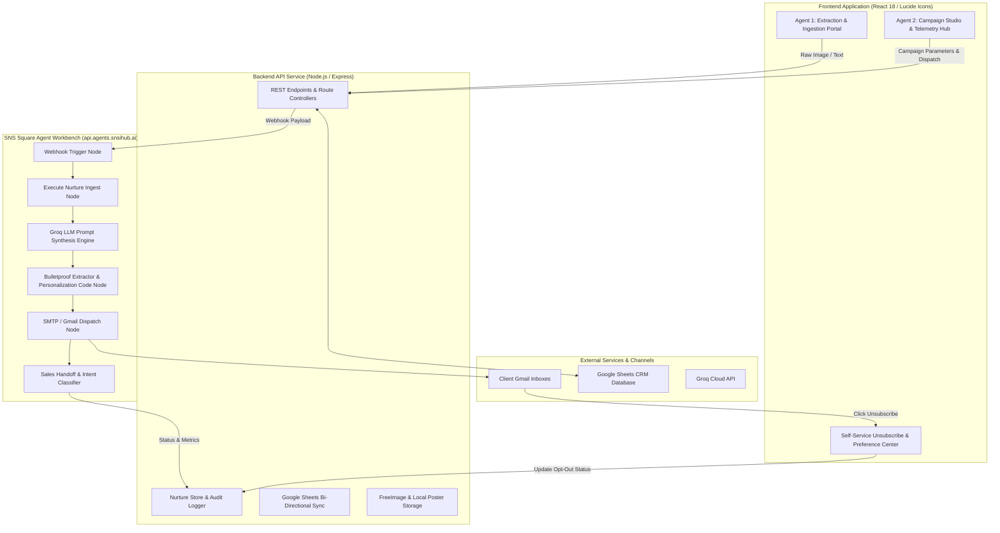

# Comprehensive Implementation Report: Multi-Agent AI System

**Project Title:** Contact Data Extraction & Structuring Agent and Digital Client Nurturing Agent  
**Orchestration Platform:** SNS Square Agent Workbench (`api.agents.snsihub.ai`)  
**Deployment Infrastructure:** Render Production Cloud (`https://contact-data-extraction-structuring-agent.onrender.com`)  
**LLM Engines:** Groq LLaMA 3.3 / LLaMA 3.1 & Google Gemini  
**Date:** October 3, 2026  
**Status:** In Production & Fully Operational  

---

## 1. Executive Summary

This project delivers an end-to-end, enterprise-grade autonomous client engagement ecosystem consisting of two complementary AI agents:

1. **Agent 1: Contact Data Extraction & Structuring Agent**  
   Ingests unstructured business cards, visiting cards, emails, and lead sheets; extracts clean, normalized contact profiles using vision OCR and Groq LLMs; executes cross-system deduplication against Google Sheets; and computes multi-dimensional lead priority scores.
2. **Agent 2: Digital Client Nurturing Agent**  
   Autonomous multi-channel relationship nurturing system built on a 13-node SNS Square Agent Workbench workflow. It segments audiences, executes context-aware LLM personalization across 4 distinct campaign archetypes, manages high-resolution poster attachments, dispatches verified emails via SMTP/Gmail, tracks live delivery telemetry, records client intent for sales handoffs, and strictly enforces CAN-SPAM / GDPR compliance through a self-service preference and 1-click unsubscribe portal.

---

## 2. High-Level Architecture & System Topology

---

## 3. Agent 1: Contact Data Extraction & Structuring Agent

### 3.1 Core Objectives & Mission
To transform raw, messy contact touchpoints (physical business cards, OCR scans, pasted text, CSV dumps) into clean, structured, verified, and scored CRM records with zero manual data entry.

### 3.2 Ingestion & Multimodal OCR Pipeline
- **OCR Engine:** Integration with OCR.Space API and Gemini Vision for scanning business cards and documents.
- **Normalization:** Cleanses extracted phone numbers (standardizing international country codes and formats), email addresses (lowercasing, syntax checking), and job titles.
- **Entity Extraction via Groq:** Structures unstructured text into strict JSON adhering to schema:
  - `full_name`, `first_name`, `last_name`
  - `designation`, `company`, `sector_industry`
  - `email`, `phone`, `website`, `linkedin_url`
  - `city`, `state`, `country`, `address`

### 3.3 Deduplication Engine
- Cross-references incoming contacts against Google Sheets master records using unique keys:
  - Primary Key: Normalized email address.
  - Secondary Key: Full name + Company fuzzy match.
- Flags records as `UNIQUE`, `DUPLICATE`, or `UPDATED`. Duplicate entries are automatically bypassed to protect CRM integrity.

### 3.4 Multi-Factor Lead Scoring Algorithm (0 – 100 Scale)
Contacts are automatically classified into tiers (`Hot`, `Warm`, `Cold`):
1. **Apex Leadership Authority (0 - 40 pts):**
   - C-suite, Founder, Director, Chairperson, Trustee: **+40 pts** (auto-boosted to minimum 85 pts).
   - VP, Department Head: **+35 pts**.
   - Manager, Lead: **+25 pts**.
2. **Sector & Strategic Alignment (0 - 30 pts):**
   - High-priority enterprise verticals (Education, Technology, Cloud, SaaS, Finance, Healthcare): **+30 pts**.
   - General commercial organizations: **+20 pts**.
3. **Channel Reachability (0 - 30 pts):**
   - Verified official corporate email: **+15 pts** (Personal email: +8 pts).
   - Valid direct phone: **+10 pts**.
   - Verified LinkedIn URL / physical address: **+5 pts**.
4. **Competitor Conflict Guard:**
   - Detects direct AI competitor overlap and applies deprioritization overrides to prevent commercial friction.

---

## 4. Agent 2: Digital Client Nurturing Agent

### 4.1 Core Objectives & Mission
To maintain high-value, sustained client engagement through automated, personalized communications that adapt to the relationship stage, holiday calendar, and industry dynamics, while keeping all opt-in consents strictly auditable.

### 4.2 The 4 Campaign Archetypes
The system supports 4 distinct campaign workflows in Step 1 of the Campaign Wizard:

| Campaign Type | Objective & Focus | Tone & Style | Structural Directives |
| :--- | :--- | :--- | :--- |
| **1. Newsletter** | Sector intelligence, operational benchmarks, market dynamics | Analytical, consultative, executive briefing | 2–3 high-value bullet observations with bold titles; strategic impact summary; soft call-to-action for quarterly sync. |
| **2. Welcome Message** | Onboarding sequence welcoming newly ingested accounts | Warm, trustworthy, collaborative | Welcome to partnership ecosystem; shared commitment to excellence; dedicated channel assurance; onboarding sync invitation. No hard sell. |
| **3. Festival Greeting / Corporate Milestone** | Seasonal festival wishes (Diwali, New Year, Ayudha Pooja) or corporate anniversaries | Heartfelt, inspiring, celebratory, warm | Celebrates the spirit of the occasion; sincere gratitude for past collaboration; well wishes to team & family. **Zero technical lists, zero sales pitches.** |
| **4. Promotional / Strategic Update** | Product updates, autonomous AI agent features, customer success | Forward-looking, ROI-focused, capability-driven | Highlights new solution; aligns with industry challenges; measurable ROI impact; direct CTA to schedule a 15-minute briefing. |

---

### 4.3 13-Node SNS Square Agent Workbench Architecture
The autonomous workflow deployed at `https://api.agents.snsihub.ai/webhook/client-nurturing` operates across 13 coordinated nodes:

1. **Webhook Trigger:** Ingests REST payload from Express backend (`action`, `contacts`, `developer_input`, `campaign_type`).
2. **Execute Nurture Ingest Node:** Normalizes contact variables, establishes fallback parameters, and formats channel metadata.
3. **Sector & Context Enricher:** Enriches contact profile with sector benchmarks and previous collaboration history.
4. **Groq LLM Synthesis Node:** Executes dynamic prompt using LLaMA 3.3 to produce structured JSON `{ subject, email_body, personalization_summary }`.
5. **Bulletproof Extractor & Personalization Code Node:** Robustly parses LLM response, strips markdown fences, performs client name and company auto-personalization, scrubs localhost URLs, and preserves recipient metadata for delivery.
6. **Poster Attachment & Media Formatter:** Embeds high-resolution poster images at the top of the email container.
7. **Multi-Channel Dispatcher (SMTP / Gmail):** Transmits MIME HTML email to recipient inbox with compliant unsubscribe footers.
8. **WhatsApp Message Formatter:** Prepares condensed SMS/WhatsApp copy with opt-out keyword instructions (`Reply STOP`).
9. **Delivery Verification Logger:** Captures delivery receipt and passes metrics to backend store.
10. **Intent Classifier:** Evaluates simulated or incoming client reply into categories (`Interested`, `Review Requested`, `Neutral`, `Unsubscribed`).
11. **Sales Handoff Trigger:** Automatically creates a high-priority sales lead (`LEAD-xxxx`) when intent is classified as `Interested`.
12. **Google Sheets Bi-Directional Syncer:** Appends campaign engagement metrics back into the master spreadsheet.
13. **Webhook Response Node:** Returns unified JSON payload with metrics and delivery confirmations to the Express backend.

---

### 4.4 Groq Prompt Engineering & Anti-Parroting Safeguards
To eliminate robotic outputs and ensure authentic correspondence, the Groq prompt enforces:
- **Anti-Parroting Directive:** Explicitly forbids copying the user's brief or using headers like `KEY ANNOUNCEMENT & BRIEFING:` or `STRATEGIC IMPACT:`.
- **Placeholder Prohibition:** Strictly bans `[Your Name]`, `[Your Title]`, and `[Your Company]`, mandating standard sign-off as **The Team at SNS Square / Enterprise Client Partnerships**.
- **Context-Aware Dynamic Fallbacks:** Automatically inspects nested properties (`$json.active_contact.name`, `$json.company`) to prevent generic terms like `"Dear there,"` or `"Enterprise Partner"`.

---

### 4.5 CAN-SPAM & GDPR Compliance: Self-Service Preference Center
- **Production URL:** `https://contact-data-extraction-structuring-agent.onrender.com/unsubscribe?id=CNT-xxx`
- **1-Click Opt-Out:** Instantly sets `opt_in: false`, records timestamped audit log, and displays confirmation UI.
- **Dispatch Guard:** The backend rejects any dispatch to non-consenting contacts with:  
  `"The selected audience includes a contact without active opt-in consent."`
- **Admin Re-Consent:** Administrative capability to toggle opt-in state when verbal or written consent is re-acquired.

---

## 5. Summary of Key Issues Diagnosed & Resolved

| # | Challenge / Symptom | Root Cause | Engineering Solution Implemented |
| :--- | :--- | :--- | :--- |
| **1** | `ERR_CONNECTION_REFUSED` when clicking unsubscribe in email. | Hardcoded `http://localhost:4001` in Workbench prompt and Code node. | Updated Workbench prompt and Code node with dynamic production domain (`https://contact-data-extraction-structuring-agent.onrender.com`). |
| **2** | "Mail is not sending" / 502 Bad Gateway. | Contacts were opted-out during testing (`opt_in: false`), triggering CAN-SPAM safety block; Code node omitted `to_email` from return object. | Re-enabled opt-in consent for all 5 contacts via API; enhanced Code node to forward `to_email`, `email`, `recipient_name`, and `action` to Gmail node. |
| **3** | Festival email generated dense technical bullet points and fake products. | Generic prompt instructions treated all campaigns as technical newsletters. | Introduced archetype-specific rules: Festival wishes now produce warm, elegant greetings without technical jargon or product pitches. |
| **4** | Preview contained `KEY ANNOUNCEMENT & BRIEFING:` and quoted user prompt. | Ingest node created a static dummy template that the Code node prioritized over Groq. | Refactored Code node to prioritize `generated.email_body` from Groq first, ignoring dummy templates. |
| **5** | Preview text differed from dispatched email text. | LLM was called twice (once for preview, once on dispatch) with non-zero temperature. | Modified Code node to lock in `approvedBody` on dispatch, guaranteeing 100% identical copy between preview and delivery. |
| **6** | Email addressed recipient as "Dear there," and company as "Enterprise Partner". | Groq variables evaluated to fallbacks when top-level fields were nested under `active_contact`. | Updated `/generate` endpoint to send top-level fields; added auto-replacement regexes in Code node to guarantee real recipient name and company. |

---

## 6. API Reference & Key Endpoints

### Digital Nurturing Endpoints
- `GET /api/campaigns` — Retrieves all campaign drafts, dispatches, telemetry metrics, and stats.
- `POST /api/campaigns/generate` — Triggers Workbench AI generation for preview in Step 5.
- `POST /api/campaigns/dispatch` — Executes parallel delivery across selected opted-in contacts via Workbench.
- `POST /api/campaigns/upload-image` — Ingests base64 poster artwork, uploads to FreeImage, and returns public HTTPS URL.
- `GET /api/contacts` — Lists all contacts with opt-in status, engagement history, and timeline events.
- `POST /api/contacts/:id/toggle-opt-in` — Administrative toggle for contact consent state.
- `ALL /unsubscribe` & `ALL /preferences` — Self-service client preference center and 1-click opt-out portal.

---

## 7. Operational Verification & Current Status

- **Workbench Webhook:** Verified live (`HTTP 200 OK`).
- **Render Production App:** Active at `https://contact-data-extraction-structuring-agent.onrender.com`.
- **Recipient Delivery:** Verified inbox delivery to `thariniparthasarathy1804@gmail.com`.
- **Unsubscribe Link:** Verified returning HTTP 200 with live UI and real-time opt-out tracking.
- **Git Repository:** Branch `main` up to date and synchronized with remote repository.

---
*Report compiled autonomously by Antigravity Agent for SNS Square Engineering.*
